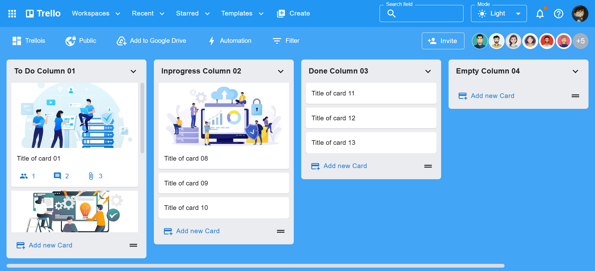

# 🚀 Trello Web – MERN Stack Clone

A full-featured Trello-style task management application built with the MERN Stack (MongoDB, Express.js, React.js, Node.js). Developed by **Luong Quang Thinh**, this project helps learners master both frontend and backend development through hands-on, real-world practice.

> This project is part of the **Full Stack MERN Pro** learning series on YouTube, focusing on practical, project-based learning.

---

## 📘 Project Overview

This application replicates many core features of the original Trello:

- Create and manage boards
- Add / edit / delete columns
- Drag-and-drop cards (powered by **DnD Kit**)
- User and member management
- Clean, modern UI inspired by Trello
- Scalable backend architecture following industry best practices

The frontend is built with **React + Vite** for ultra-fast development, styled with **Material UI** for a polished and responsive interface.  
The backend uses **Express.js + MongoDB**, complete with RESTful APIs and **JWT authentication**.

---

## 🧰 Tech Stack

### 🖥️ Frontend
- React.js 18+
- Vite
- Material UI (MUI)
- Redux Toolkit
- React DnD Kit
- React Router DOM
- Axios
- ESLint

### 🗄️ Backend
- Node.js
- Express.js
- MongoDB & Mongoose
- JWT Authentication
- REST APIs

---

## ⚙️ Setup & Installation

### 🔧 Run Backend Locally

Requirements: Node.js, Yarn, MongoDB

```sh
cd api
yarn install
yarn dev

```
Backend runs on: http://localhost:8017

### 💻 Run Frontend Locally

To run the frontend of this project locally, use the following commands:

```bash
cd web

yarn install

yarn dev
```
Frontend runs on: http://localhost:8173

### Giao diện
